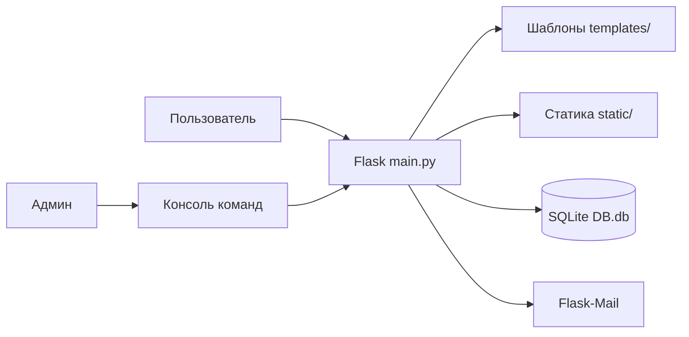
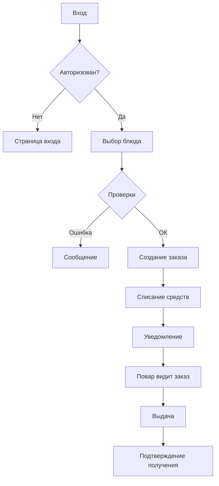
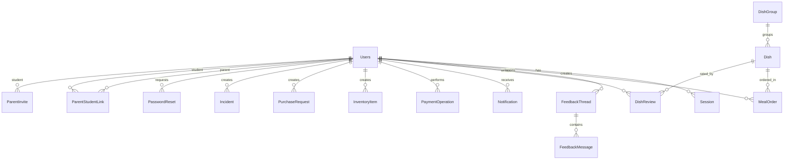

# Документация проекта «Умная столовая»

## 1. Титульный лист
- **Название кейса:** Командный кейс № 2 «Управление столовой»
- **Название проекта:** Веб-приложение «Умная столовая»
- **Команда:**
  1) Участник 1 (ФИО)
  2) Участник 2 (ФИО)
  3) Участник 3 (ФИО)
- **Учебная группа/класс:** _заполнить_
- **Год:** 2026

## 2. Описание проекта

«Умная столовая» — веб-приложение для автоматизации школьной столовой. Включает:
- каталог блюд с группами, фото, описанием, составом и ценой;
- оформление и выдача заказов с проверкой баланса и ограничений;
- родительский контроль (привязка ребёнка, лимиты трат, запрещённые/разрешённые продукты);
- платежи, пополнение баланса, история операций;
- интерфейс кухни: выдача заказов, учёт склада, заявки на закупку, фиксация инцидентов;
- обратная связь через тикеты с перепиской;
- уведомления с фильтрацией по категориям;
- отчёты с графиками и экспортом в CSV/ZIP;
- административная консоль (терминал + веб);
- тёмная и светлая тема;
- восстановление пароля по email;
- загрузка аватаров и изображений блюд (автоконвертация в AVIF).

## 3. Обоснование выбора языка и инструментов

| Инструмент | Зачем |
|-----------|-------|
| Python 3.10+ | Основной язык — понятный синтаксис, богатая экосистема |
| Flask | Лёгкий веб-фреймворк, не навязывает архитектуру |
| SQLAlchemy | ORM — работа с БД без ручного SQL |
| SQLite | Файловая БД, не требует установки сервера |
| Flask-Mail | Email-уведомления и восстановление пароля |
| Pillow + pillow-avif-plugin | Обработка и конвертация изображений в AVIF |
| Jinja2 | Шаблонизатор с автоэкранированием (защита от XSS) |
| Vanilla JavaScript | Интерактивность без внешних зависимостей |

## 4. Структурная схема



## 5. Блок-схема основного алгоритма

Процесс заказа блюда:



Проверки при заказе:
1. Роль пользователя (student или parent)
2. Достаточность баланса
3. Родительские ограничения: запрещённые продукты, разрешённые продукты, дневной лимит
4. Если parent — наличие привязанного ребёнка

## 6. База данных

### Тип СУБД
**SQLite** — файловая БД (`site/DB.db`), создаётся автоматически при первом запуске. Не требует отдельного сервера.

### Схема (17 таблиц)



### Описание таблиц

| Таблица | Назначение | Основные поля |
|---------|-----------|---------------|
| Users | Пользователи | email, psw (хеш), name, surname, role, balance, is_active |
| Session | Сессии авторизации | user_id, token, ip_address, expires_at, is_active |
| DishGroup | Группы блюд (категории) | title, description, sort_order, is_active |
| Dish | Блюда | title, composition, price, calories, proteins, fats, carbohydrates, image_path |
| DishReview | Отзывы на блюда | dish_id, user_id, rating (1-5), review_text |
| MealOrder | Заказы | user_id, payer_user_id, dish_id, price, status, meal_date |
| PaymentOperation | Платёжные операции | user_id, target_user_id, amount, kind, description |
| FeedbackThread | Обращения (тикеты) | user_id, subject, status (open/closed) |
| FeedbackMessage | Сообщения в тикетах | thread_id, user_id, role, body |
| Notification | Уведомления | user_id, title, body, link, is_read |
| PasswordReset | Запросы сброса пароля | user_id, code, expires_at, is_used |
| ParentStudentLink | Связь родитель — ребёнок | parent_id, student_id, daily_limit, forbidden_products |
| ParentInvite | Инвайты для привязки | student_id, code, token, expires_at |
| InventoryItem | Складские позиции | name, unit, quantity, min_quantity |
| PurchaseRequest | Заявки на закупку | item_name, quantity, unit, expected_cost, status |
| Incident | Инциденты на кухне | kind, severity, status, title, description |
| CFG | Конфигурация | cfg (ключ), value (JSON) |

## 7. Роли и права доступа

| Роль | Уровень | Доступ | Время сессии |
|------|---------|--------|-------------|
| student | 1 | Просмотр меню, заказы, профиль, баланс | 24 ч |
| parent | 2 | + управление ребёнком, ограничения, контроль трат | 12 ч |
| moder | 3 | + просмотр и ответ на все обращения | 8 ч |
| chef | 4 | + кухня, склад, выдача заказов | 8 ч |
| admin | 5 | + управление пользователями, настройки проекта | 6 ч |
| super_admin | 6 | Полный доступ, консоль, критичные операции | 5 ч |

## 8. Маршруты приложения

| URL | Метод | Описание |
|-----|-------|---------|
| `/` | GET | Главная — каталог блюд по группам |
| `/reg/new/` | GET, POST | Регистрация нового пользователя |
| `/login/new/` | GET, POST | Авторизация |
| `/logout/` | GET | Выход |
| `/profile/` | GET, POST | Профиль, привязка детей, настройки уведомлений |
| `/orders/` | GET | История заказов с фильтрами |
| `/dish/<id>/` | GET | Карточка блюда, отзывы |
| `/dish/<id>/order/` | POST | Оформление заказа |
| `/dish/<id>/review/` | POST | Отправка отзыва |
| `/order/<id>/received/` | POST | Подтверждение получения |
| `/menu/group/<key>/` | GET | Страница группы блюд |
| `/kitchen/` | GET, POST | Интерфейс кухни (повар/админ) |
| `/feedback/` | GET, POST | Список обращений, создание тикета |
| `/feedback/<id>/` | GET, POST | Тикет — переписка |
| `/notifications/` | GET | Уведомления с фильтрацией |
| `/reports/` | GET | Отчёты с графиками |
| `/reports/export.zip` | GET | Экспорт отчётов в ZIP/CSV |
| `/pay/` | GET, POST | Пополнение баланса |
| `/settings/` | GET, POST | Настройки проекта (admin+) |
| `/admin_console/` | GET, POST | Веб-консоль (super_admin) |
| `/setup/` | GET, POST | Мастер первичной настройки |
| `/password/restore/` | GET, POST | Запрос восстановления пароля |
| `/password/reset/<code>/` | GET, POST | Сброс пароля по ссылке |
| `/create_dish/` | GET, POST | Создание блюда (admin+) |
| `/create_menu_group/` | GET, POST | Создание группы блюд (admin+) |
| `/upload_avatar/` | POST | Загрузка аватара (JSON API) |
| `/del_ava/` | GET | Удаление аватара |
| `/del_account/` | GET, POST | Удаление аккаунта |
| `/family/link/<token>/` | GET | Привязка ребёнка по ссылке |

## 9. Безопасность

- **Хеширование паролей** — `werkzeug.security` (pbkdf2:sha256)
- **Токены сессий** — `secrets.token_urlsafe(64)`, хранятся в httponly cookie
- **CSRF-защита** — токен генерируется в сессии, проверяется на каждый POST/PUT/PATCH/DELETE. Инжектируется в формы автоматически через JavaScript
- **SQL Injection** — защита через ORM (параметризованные запросы SQLAlchemy)
- **XSS** — автоэкранирование Jinja2

## 10. Родительский контроль

### Привязка ребёнка
1. Школьник создаёт инвайт-код в профиле (действует до 7 дней)
2. Родитель вводит код в своём профиле или переходит по ссылке `/family/link/<token>/`
3. Создаётся связь `ParentStudentLink`

### Настройка ограничений
Родитель может задать для каждого ребёнка:
- **Дневной лимит** — максимальная сумма заказов в день (₽)
- **Разрешённые продукты** — белый список (если задан, только эти продукты можно заказать)
- **Запрещённые продукты** — чёрный список
- **Обязательные продукты** — должны присутствовать в составе блюда

Все ограничения проверяются автоматически при каждом заказе.

## 11. Административная консоль

Доступна в двух вариантах:
- **CLI** — в терминале при запуске `main.py`
- **Веб** — `/admin_console/` (только super_admin)

### Основные команды

```
help                          Список команд
list_users [limit]            Список пользователей
user_info <id>                Карточка пользователя
change_role <id> <role>       Сменить роль
activate_user <id>            Включить аккаунт
deactivate_user <id>          Выключить аккаунт
delete_user <id>              Мягкое удаление
sessions                      Активные сессии
kill_session <id>             Завершить сессию
list_dishes [limit]           Список блюд
list_orders [limit]           Заказы
order_stats                   Статистика заказов
list_payments [limit]         Платежи
payment_stats                 Статистика платежей
list_inventory [limit]        Склад
inventory_stats               Сводка по складу
list_incidents [limit]        Инциденты
feedback_stats                Обращения
list_reviews [limit]          Отзывы
get_cfg <name>                Прочитать параметр
set_cfg <name> <value>        Изменить параметр
system_info                   Информация о системе
setup_wizard                  Повторный мастер настройки
EXIT                          Выход
```

## 12. Структура проекта

```
school_project-main/
├── site/                        # Основное приложение
│   ├── main.py                  # Точка входа, маршруты, модели, логика (3800 строк)
│   ├── custom_console.py        # Админ-консоль (40+ команд)
│   ├── DB.db                    # БД SQLite (создаётся автоматически)
│   ├── templates/               # HTML-шаблоны
│   │   ├── layout.html          # Базовый шаблон (header, footer, навигация)
│   │   ├── index.html           # Главная — каталог блюд
│   │   ├── login.html           # Вход
│   │   ├── reg.html             # Регистрация
│   │   ├── profile.html         # Профиль пользователя
│   │   ├── orders.html          # История заказов
│   │   ├── dish_information.html # Карточка блюда
│   │   ├── kitchen.html         # Интерфейс кухни
│   │   ├── feedback.html        # Обращения
│   │   ├── feedback_thread.html # Тикет — переписка
│   │   ├── notifications.html   # Уведомления
│   │   ├── reports.html         # Отчёты
│   │   ├── admin.html           # Веб-консоль
│   │   ├── settings.html        # Настройки проекта
│   │   ├── pay.html             # Пополнение баланса
│   │   ├── setup.html           # Мастер настройки
│   │   ├── create_dish.html     # Создание блюда
│   │   ├── create_menu_group.html # Создание группы блюд
│   │   ├── del_account.html     # Удаление аккаунта
│   │   ├── message.html         # Информационное сообщение
│   │   ├── menu_group.html      # Страница группы блюд
│   │   └── ...                  # Шаблоны для email и подтверждений
│   └── static/
│       ├── style.css            # Основные стили
│       ├── theme.css            # Стили тёмной/светлой темы
│       ├── admin.css            # Стили админ-панели
│       ├── js/
│       │   ├── script.js        # Анимации, CSRF-инъекция, интерактивность
│       │   ├── theme.js         # Переключение темы
│       │   ├── panel.js         # Выпадающее меню пользователя
│       │   ├── avatar.js        # Загрузка аватара
│       │   ├── profile.js       # Смена иконок по теме
│       │   └── scroll_remember.js # Сохранение позиции скролла
│       ├── icons/               # Иконки и фото блюд
│       │   └── dishes/          # Фото блюд (AVIF)
│       ├── bg/                  # Фоновые изображения
│       └── ico/                 # Favicon
├── requirements.txt             # Зависимости Python
├── README.md                    # Краткое описание и запуск
└── ДОКУМЕНТАЦИЯ.md              # Этот файл
```

## 13. Установка и запуск

### Требования
- Python 3.10+
- pip

### Запуск

```powershell
cd school_project-main
python -m venv .venv
.\.venv\Scripts\Activate.ps1
pip install -r requirements.txt
python .\site\main.py
```

Открыть `http://127.0.0.1:5000`

### Первый запуск
1. В консоли отображается **код доступа** к мастеру настройки
2. Перейти на `/setup/`, ввести код
3. Заполнить название, email и пароль супер-администратора
4. Войти через `/login/new/`

## 14. Ссылки
- **Репозиторий:** _добавить URL_
- **Видео-демонстрация:** _добавить URL_
